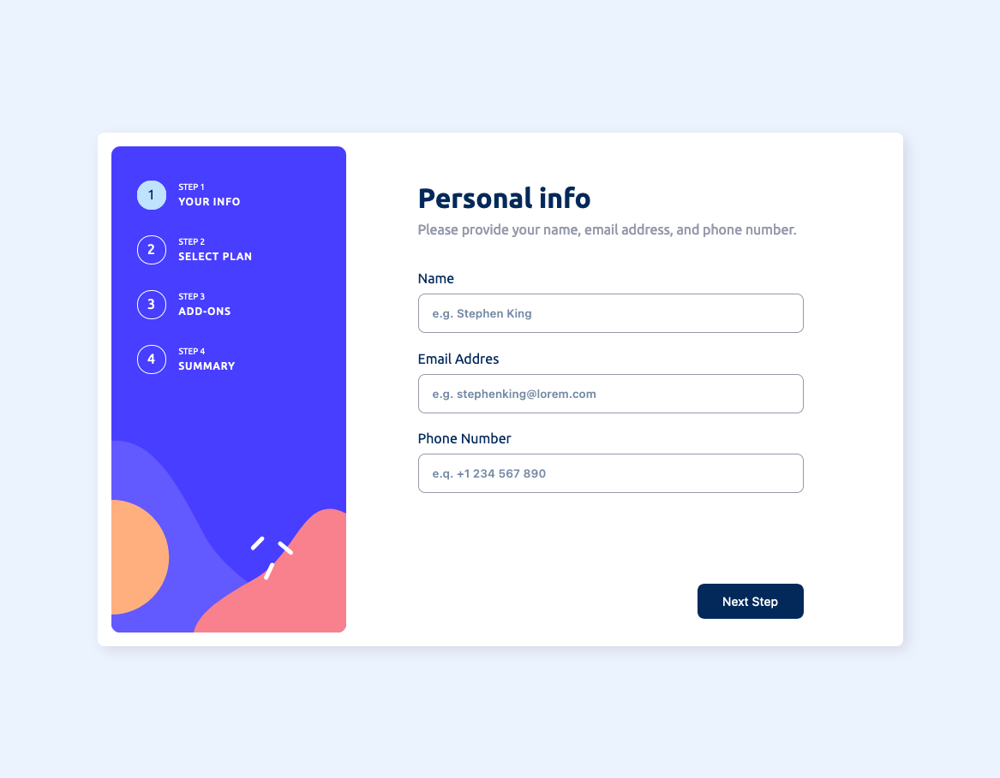
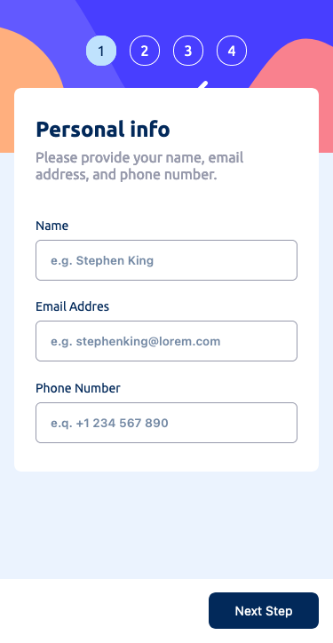

# Frontend Mentor - Multi-step form solution

This is a solution to the [Multi-step form challenge on Frontend Mentor](https://www.frontendmentor.io/challenges/multistep-form-YVAnSdqQBJ). Frontend Mentor challenges help you improve your coding skills by building realistic projects. 

## Table of contents

- [Overview](#overview)
  - [The challenge](#the-challenge)
  - [Screenshot](#screenshot)
  - [Links](#links)
- [My process](#my-process)
  - [Built with](#built-with)
  - [Continued development](#continued-development)
- [Author](#author)

## Overview

### The challenge

Users should be able to:

- Complete each step of the sequence
- Go back to a previous step to update their selections
- See a summary of their selections on the final step and confirm their order
- View the optimal layout for the interface depending on their device's screen size
- See hover and focus states for all interactive elements on the page
- Receive form validation messages if:
  - A field has been missed
  - The email address is not formatted correctly
  - A step is submitted, but no selection has been made

### Screenshot

### Links

- Solution URL: [Solution](https://alaiet.github.io/multi-step-form)
- Live Site URL: [Live Site](https://github.com/AlaieT/multi-step-form/multi-step-form/)

## My process

 1. Wireframe template
 2. Responsive + mobile design
 3. Styles(colors + sizes)
 4. From logic
 5. Some fixes

### Built with

- Semantic HTML5 markup
- SASS/SCSS
- Flexbox
- CSS Grid
- [React](https://reactjs.org/) - JS library
- [Vite](https://vitejs.dev/) - Module bundler
- [React-Hook-Form](https://react-hook-form.com/) - Form validation for react
- [SASS/SCSS](https://sass-lang.com/) - FrameWork for css
- [Yup](https://github.com/jquense/yup) - Schemas for validation
- [Typescript](https://www.typescriptlang.org/) - Types for JS

### Continued development

I would like to wirte some unit and integrated tests for this project.
End-to-end test using Cypress.
Impove/rewrite some styles/jsx/types.

## Author

- Frontend Mentor - [@yourusername](https://www.frontendmentor.io/profile/AlaieT)